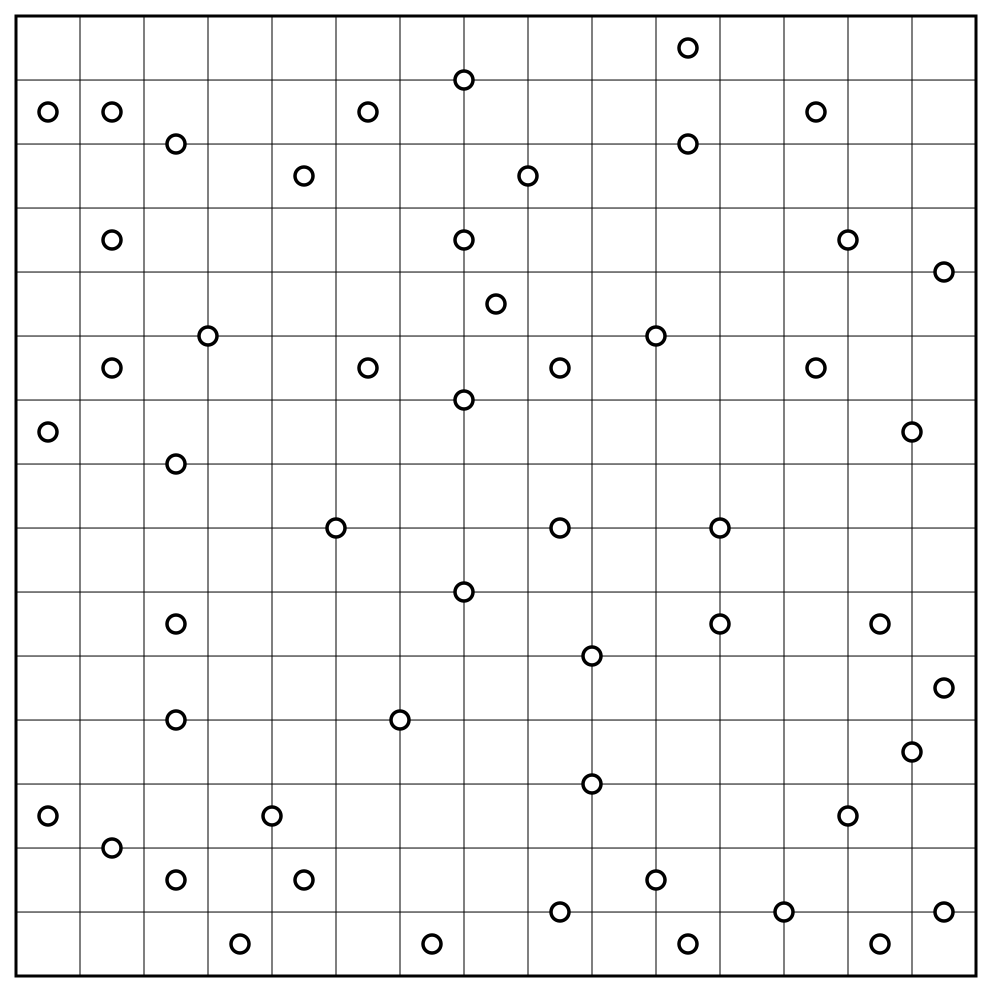
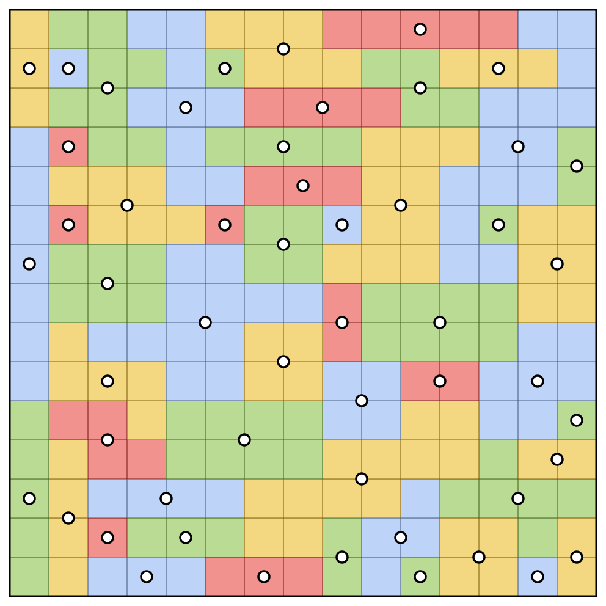

# Galaxies Rules

Galaxies (also known as Tentai Show, Tentaisho, Spiral Galaxies, or Sym-a-Pix) is a grid-based puzzle where the goal is to divide the grid into distinct regions according to the following rules:

1. Each region must contain exactly one circle (or dot), which acts as the center of the region.
2. Each region must have rotational symmetry around its center. This means if you rotate the region 180° around its circle, you get the exact same shape in the exact same position.
3. The entire grid must be filled with regions.

## Example

| Puzzle | Solution |
| :---: | :---: |
|  |  |

## Variations

* The grid doesn't have to be rectangular; puzzles on irregular grids exist.
* Sometimes, the dots are colored, which indicates which color to use for each region. This can be used to reveal a picture.

## Links to Galaxies puzzles

* https://www.puzzle-galaxies.com/
