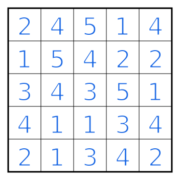
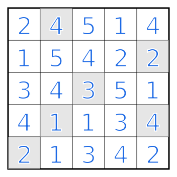

# Hitori Rules

Hitori (Japanese for "alone" or "one person") is a logic puzzle played on a grid filled with numbers. The goal is to shade certain cells according to the following rules:

1. No number can appear unshaded more than once in any row or column.
2. Shaded (black) cells cannot be adjacent horizontally or vertically to each other.
3. All unshaded (white) cells must be connected horizontally or vertically (they must form a single contiguous group).

## Example

| Puzzle | Solution |
| :---: | :---: |
|  |  |

## Variations

* This can also be played on a non-rectangular grid.

## Links to Hitori puzzles

* https://www.puzzle-hitori.com/
