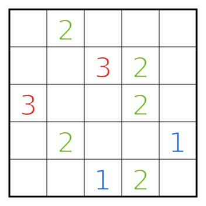
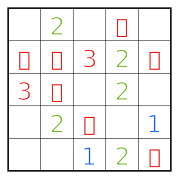

# Minesweeper Rules

Minesweeper (also called "tentaizu") puzzles consist of a rectangular grid that contains some numbers.

The aim is to identify which cells contain mines, by satsifying the following condition:

* Each number indicates how many mines are adjacent to it (including diagonally).

## Example

| Puzzle | Solution |
| :---: | :---: |
|  |  |

## Variations

* Some minesweeper puzzles specify the total number of mines in the grid; typically, this extra knowledge is required to uniquely solve the grid.
* Minesweeper puzzles work equally well on non-square grids.

## Links to Minesweeper puzzles

* https://puzzlemadness.co.uk/minesweeper/
