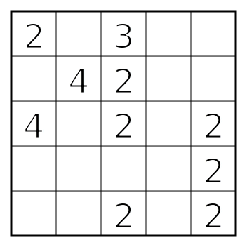
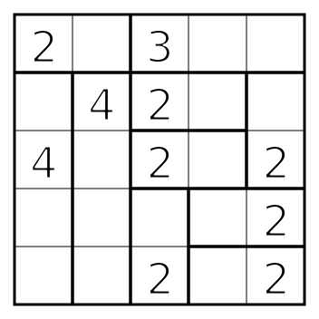

# Shikaku Rules

Shikaku (Japanese for "divide by squares", and also known as Rectangles or Divide by Box) is a logic puzzle played on a grid — almost always square — with numbers scattered through some of its cells.

The goal is to cut the grid into rectangles, one for each number, according to the following rules:

1. The grid is divided into rectangular regions (a square counts as a rectangle).
2. Each rectangle contains exactly one number.
3. That number gives the area of its rectangle: the count of cells it covers.
4. Every cell belongs to exactly one rectangle — together they cover the grid, and none of them overlap.

It follows that a puzzle has exactly as many rectangles as it has numbers, and that the numbers sum to the number of cells in the grid.

## Example

| Puzzle | Solution |
| :---: | :---: |
|  |  |

## Variations

* This can also be played on a non-square grid.

## Links to Shikaku puzzles

* https://www.puzzle-shikaku.com/
